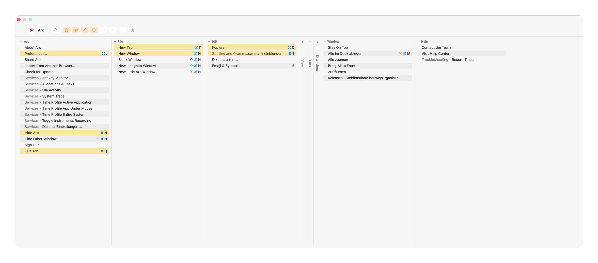
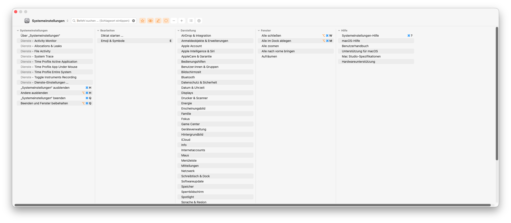

# ShortKeyOrganiser

A macOS menu-bar app that does two things for **any** app's menu commands:

1. **Command overlay** - a fast, searchable, KeyClu-style overview of every keyboard shortcut in the front app. Tap the trigger twice and hold for a quick peek; tap three times to keep it open and search. Commands are grouped by menu, modifiers are colour-coded, and while you hold a modifier the matching commands light up.
2. **Rebind menu shortcuts** - hover a menu item, hold the trigger, and set your own shortcut for it (per app or globally) - written straight into the native `NSUserKeyEquivalents`, the same mechanism as *System Settings → Keyboard → Keyboard Shortcuts → App Shortcuts*.

Runs as a menu-bar agent (no Dock icon). Built in Swift/AppKit + SwiftUI on native macOS APIs.





## Features

- **Searchable overlay** of the front app's commands, grouped by menu, with colour-coded modifiers (⌘ blue, ⇧ green, ⌥ orange, ⌃ pink).
- **Live key highlight:** hold ⌘ (or any modifier) and the commands you could trigger light up in yellow.
- **Run a command** by clicking its row; **rebind** or **reset** a shortcut inline.
- **Peek & pin triggers:** double-tap-and-hold = peek, triple-tap = stay open. Modifier and timings are configurable.
- **Favourites, hide, collapsible columns** - a collapsed column shrinks to a slim lane with a rotated title.
- **Background style:** opaque, see-through (adjustable), or frosted glass.
- **Central settings** with a sidebar: Shortcuts, View, Management & Help.

## Install

**One line in Terminal** - downloads the notarised release, installs it to Applications, launches it:

```bash
curl -fsSL https://raw.githubusercontent.com/Stebibastian/ShortKeyOrganiser/main/web-install.sh | bash
```

**Or manually:** download **`ShortKeyOrganiser.zip`** from the [latest release](https://github.com/Stebibastian/ShortKeyOrganiser/releases/latest), unzip, drag **ShortKeyOrganiser.app** into `/Applications`, open it.

Either way, grant **Accessibility** on first launch - the app relaunches itself. It's signed with a Developer ID certificate and notarised by Apple, so it runs on any Mac with **no Gatekeeper warning**.

### Build from source instead

```bash
xcode-select --install   # once, if not already installed
git clone https://github.com/Stebibastian/ShortKeyOrganiser.git
cd ShortKeyOrganiser
./install.sh             # set up local signing + build + install + launch
```

`install.sh` does everything silently (its own signing keychain, no dialogs). To build a fresh notarised release zip yourself: `./make-release.sh`.

### First launch: grant permission

1. A prompt appears → **System Settings → Privacy & Security → Accessibility** → enable **ShortKeyOrganiser**.
2. After enabling, the app **relaunches itself** so a fresh process picks up the keyboard tap reliably. If it doesn't relaunch: ⌘ menu → Quit, then open again.
3. If the trigger still doesn't react, also enable it under **Input Monitoring**.

## Usage

**Overlay:** press the trigger key **twice and hold** on the second press → the overlay appears with every shortcut of the front app. Press **three times** to keep it open and searchable (Esc closes it). While the overlay is up, hold a modifier to highlight matching commands; type a ⌘-shortcut to run it directly; click a row to run it.

**Rebind a shortcut:**

1. Open any app's menu (e.g. **Edit**).
2. Hover the item you want (e.g. **Find**).
3. Hold the trigger key (~0.6 s) → the menu closes and a window appears.
4. Press the new shortcut (e.g. ⌘⇧F), pick scope (this app / all apps), confirm.
5. For "this app only", relaunch the app so its menu shows the new shortcut.

Trigger keys and hold times are configurable in **Settings → Shortcuts**. Modifiers are used as triggers on purpose: a letter key would trigger type-select in open menus, and ⌃/⇧ (unlike ⌥/⌘) don't reveal alternate menu items.

## How it stores shortcuts

It writes the native **`NSUserKeyEquivalents`** preference - exactly what *System Settings → Keyboard → Keyboard Shortcuts → App Shortcuts* uses, so your change shows up there and is fully compatible.

```bash
defaults read com.example.app NSUserKeyEquivalents     # per app
defaults read -g NSUserKeyEquivalents                  # all apps
defaults delete com.example.app NSUserKeyEquivalents   # reset
```

## Limits & gotchas

- **Real menu commands only** - it reads the menu item under the cursor (title read directly, no error-prone retyping).
- **Relaunch needed** - apps read `NSUserKeyEquivalents` when they build their menus, so a new shortcut usually shows after an app restart.
- **Electron apps** (Claude, VS Code, Slack …): native `NSMenu` usually honours `NSUserKeyEquivalents`, but some build their menus themselves and override it. Classic AppKit apps (Finder, Mail, Preview, Safari, Pages …) work reliably.
- **Conflicts:** two menu items can't share the same shortcut; the global scope has a higher conflict risk.
- **Special keys** (F-keys, arrows, Return …) are best-effort; the common ⌘/⌥/⌃/⇧ + letter/digit cases are solid.

## Architecture

| File | Role |
|---|---|
| `FullMenuScanner.swift` | Reads the front app's full menu bar via Accessibility |
| `BrowseView.swift` / `BrowseWindow.swift` | The searchable overlay (SwiftUI) + its window/host, follows the front app |
| `PeekTriggerDetector.swift` / `LongPressDetector.swift` | Global event taps for the peek/pin and hover-rebind triggers |
| `RecorderPanel.swift` | "Rebind?" window with shortcut capture + scope picker |
| `Shortcut.swift` / `Preferences.swift` | Encode & read `NSUserKeyEquivalents` (per app / global) |
| `SettingsView.swift` / `Settings.swift` | Central settings window + stored preferences |
| `Strings.swift` | All user-facing text in one place (localisation) |
| `AppDelegate.swift` | Menu-bar icon, permission flow, wiring |
| `install.sh` / `make-app.sh` / `uninstall.sh` | Build, install, uninstall |

## Distribution

**The Mac App Store is not possible** for this tool: the App Store requires the App Sandbox, and this app needs exactly what the sandbox forbids - a global keyboard tap, Accessibility access to other apps, and writing other apps' preferences (`NSUserKeyEquivalents`). That's why comparable tools (KeyClu, BetterTouchTool, Karabiner, Rectangle) are all **outside** the App Store too.

The right path is **Developer ID + notarisation**: "Developer ID Application" certificate → `codesign --options runtime` → `xcrun notarytool submit` → `xcrun stapler staple`. That's exactly what [`make-release.sh`](make-release.sh) does, and how the GitHub releases here are built - a signed, notarised `.app` that runs on any Mac with no Gatekeeper warning.

## Uninstall

```bash
./uninstall.sh
```

Removes the app, its preferences, the Accessibility (TCC) grant, the local signing keychain and build artefacts. Your menu shortcuts set in other apps are left untouched. To also reset the shortcuts this tool set, do that first in Settings → Management & Help → Manage shortcuts → Reset all.
